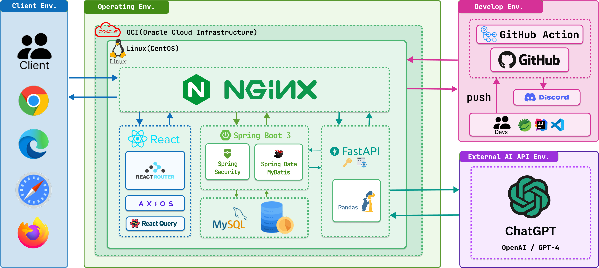

# 경기도 스마트 여행 플래너 — Backend

> **팀명**: 식스센스 (SixSense) · **팀원**: 김영훈, 김지태, 노송현, 소제우, 손상진, 한상인  
> **배포도메인**: https://sstour.cloud/

경기도 내 여행지 정보를 제공하고, AI가 동선 최적화된 여행 일정을 자동으로 생성해주는 웹 서비스의 **Java Spring 백엔드** 레포지토리입니다.

---

## 목차

- [프로젝트 소개](#프로젝트-소개)
- [기술 스택](#기술-스택)
- [인프라 구성](#인프라-구성)
- [주요 기능](#주요-기능)
- [패키지 구조](#패키지-구조)
- [API 엔드포인트](#api-엔드포인트)
- [데이터베이스 구조](#데이터베이스-구조)
- [팀원 소개](#팀원-소개)

---

## 프로젝트 소개

**경기도 스마트 여행 플래너**는 경기도 내 다양한 여행지(볼거리·먹거리·놀거리·잘거리) 정보를 제공하며, 사용자가 지역·기간·테마를 선택하면 **GPT-4o 기반 AI가 동선 최적화된 여행 일정을 자동 생성**해주는 플랫폼입니다.

| 구분 | 내용 |
|------|------|
| 프로젝트명 | 경기도 스마트 여행 플래너 서비스 클라우드 배포 프로젝트 |
| 개발 기간 | 2025.12.29 ~ 2026.06.23 |

---

## 기술 스택

| 분류 | 기술 |
|------|------|
| Language | Java |
| JDK | OpenJDK 21 |
| Framework | Spring Framework |
| ORM | MyBatis 3.x |
| Security | Spring Security + JWT |
| Server | Apache Tomcat 10.1.x |
| DBMS | MySQL 8.0.26 |
| AI 연동 | FastAPI (localhost:8090) + GPT-4o |
| 소셜 로그인 | Kakao OAuth |
| 지도 | Kakao Maps API |

---

## 인프라 구성



| 구분 | 내용 | 비고 |
|------|------|------|
| 클라우드 | OCI (Oracle Cloud Infrastructure) | 운영 환경 |
| OS | Linux CentOS 8 | 서비스 서버 |
| 웹 서버 | NGINX | 리버스 프록시 / 정적 파일 서빙 |
| CI/CD | GitHub Actions | push 이벤트 자동 배포 |
| 소스 관리 | GitHub | 버전 관리 |
| 알림 | Discord | 빌드·배포 결과 알림 |

---

## 주요 기능

### 계정 관리
- 이메일 + 비밀번호 로그인 / 카카오 OAuth 소셜 로그인
- BCrypt 비밀번호 암호화
- Access Token + Refresh Token 이중 구조 (HttpOnly 쿠키)
- 새로고침 시 Refresh Token 검증 → Access Token 재발급 → 자동 로그인 유지
- 로그인 5회 실패 시 제한 처리
- 이메일 찾기 / 비밀번호 재설정 (임시 비밀번호 이메일 전송)
- 회원 탈퇴 시 이메일·닉네임 마스킹 처리

### 여행지 (볼거리·먹거리·놀거리·잘거리)
- 지역코드 기반 장소 카드 목록 조회
- 카테고리·필터 기반 목록 조회 (최신순·인기순)
- 장소 상세 정보 / 이미지 목록 조회
- 찜 여부 확인 / 찜 토글 / 찜 목록 일괄 조회
- 리뷰 & 평점 CRUD
- 신고 등록 (리뷰·게시글·댓글 대상 / 누적 5회 자동 블라인드)

### 🤖 AI 여행 일정 (내거리)
- 지역코드 + 테마코드 기반 여행 장소 목록 조회
- FastAPI(`/ai/travel/plan`) 호출 → GPT-4o 연계 일정 생성
- AI 일정 저장 / 수정 / 날짜 수정 / 상세 조회 / 복사 / Soft Delete

### 커뮤니티 (뽐낼거리)
- 핫플거리·인생거리 게시글 목록·상세·등록·수정·삭제 (Soft Delete)
- 인기 해시태그 TOP 5 조회
- 좋아요 토글 / 좋아요 일괄 조회
- 댓글 CRUD / 댓글 수 동기화
- 조회수 증가
- AI 저장 일정 목록 조회 / 일정 내 장소 목록 조회 (인생거리 연동)

### 통합 검색
- 장소 키워드 + 카테고리 복합 검색 (페이징)
- 커뮤니티 키워드 검색 (페이징)

### 마이페이지
- 회원 정보 수정 / 프로필 이미지·배경 이미지 업로드
- 비밀번호 변경 (LOCAL 회원 전용)
- 회원 탈퇴

### 관리자
- 통계 대시보드 (전체 회원수·게시글수 / 최근 가입 회원 / 최근 게시글)
- 회원 목록·등록·수정·상태 변경·강제 탈퇴·정지 사유 조회
- 장소(볼거리·먹거리·놀거리·잘거리) 목록·상세·수정·상태 변경
- 커뮤니티 게시글·댓글·리뷰 목록·상세·수정·상태 변경
- 신고 목록 조회·처리 상태 변경
- 공지사항·FAQ 등록·수정·삭제
- 공통코드 목록 조회·등록·수정·삭제 (코드 중복 확인 포함)

### 고객지원
- 공지사항 목록 조회
- FAQ 목록 조회

---

## 패키지 구조

```
cloud.sstour.sst
├── admin
│   ├── controller       # AdminDashboardController
│   ├── mapper           # AdminDashboardMapper
│   └── service          # AdminDashboardService
├── auth
│   ├── controller       # AuthController
│   ├── mapper
│   └── service          # AuthService
├── community
│   ├── comment
│   │   ├── controller   # CommentController, AdminCommentController
│   │   ├── mapper       # CommentMapper
│   │   └── service      # CommentService, AdminCommentService
│   ├── life
│   │   ├── controller   # CommunityLifeController
│   │   ├── mapper       # CommunityLifeMapper
│   │   └── service      # CommunityLifeService
│   ├── controller       # CommunityController, AdminCommunityController
│   ├── mapper           # CommunityMapper
│   └── service          # CommunityService, AdminCommunityService
├── content
│   ├── controller       # AdminFoodController 등
│   ├── mapper           # CodeMasterMapper 등
│   └── service          # AdminFoodService 등
├── customersupport
│   ├── controller       # AdminCustomerSupportController
│   ├── mapper           # CustomerSupportMapper
│   └── service          # AdminCustomerSupportService
├── global
│   └── code
│       ├── controller   # CommonCodeController
│       ├── mapper       # CommonCodeMapper
│       └── service      # CommonCodeService
├── member
│   ├── controller       # AdminMemberController
│   ├── mapper           # MemberMapper
│   └── service          # AdminMemberService
├── plan
│   ├── controller       # AiPlanController
│   ├── mapper           # AiPlanMapper
│   └── service          # AiPlanService
├── report
│   ├── controller       # AdminReportController
│   ├── mapper           # ReportMapper
│   └── service          # AdminReportService
└── search
    ├── controller       # SearchController
    ├── mapper           # SearchMapper
    └── service          # SearchService
```

---

## 데이터베이스 구조

총 **27개 테이블** (MySQL 8.0.26)

| 테이블명 | 논리명 |
|---------|--------|
| CMM_GROUP_CODE | 공통코드 그룹 |
| CMM_CODE | 공통코드 |
| FILE | 파일 |
| MEMBER | 회원 |
| MEMBER_STATUS_LOG | 회원 상태 변경 이력 |
| MEMBER_WITHDRAWAL_LOG | 회원 탈퇴 이력 |
| REGION | 지역 |
| PLACE | 장소 |
| PLACE_SEE | 볼거리 상세 |
| PLACE_FOOD | 먹거리 상세 |
| PLACE_PLAY | 놀거리 상세 |
| PLACE_SLEEP | 잘거리 상세 |
| PLACE_IMG | 장소 이미지 |
| PLACE_TAG_MAP | 장소 태그 매핑 |
| PLACE_WISHLIST | 장소 찜 |
| AI_SCHEDULE | AI 일정 |
| AI_SCHEDULE_DAY | AI 일정 상세 (날짜별) |
| AI_SCHEDULE_PLACE | AI 일정 장소 |
| COMMUNITY | 커뮤니티 (뽐낼거리) |
| COMMUNITY_FILE_MAP | 커뮤니티 파일 매핑 |
| COMMUNITY_LIKE | 커뮤니티 좋아요 |
| HASHTAG | 해시태그 |
| COMMUNITY_HASHTAG | 커뮤니티 해시태그 매핑 |
| COMMENT | 댓글 |
| REVIEW | 리뷰 & 평점 |
| REPORT | 신고 |
| CUSTOMER_SUPPORT | 고객지원 (공지/FAQ) |

---

> 📎 **관련 레포지토리**
> - [Frontend (React)](https://github.com/mojitt/sst-front)
> - [FastAPI (AI)](https://github.com/mojitt/sst-fastApi)
